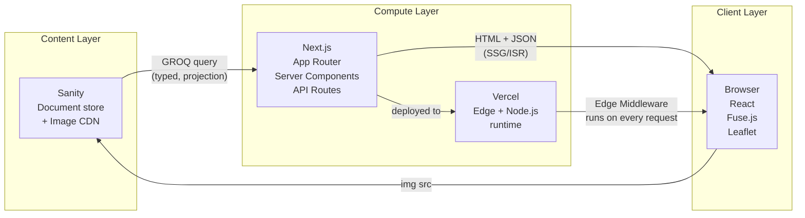
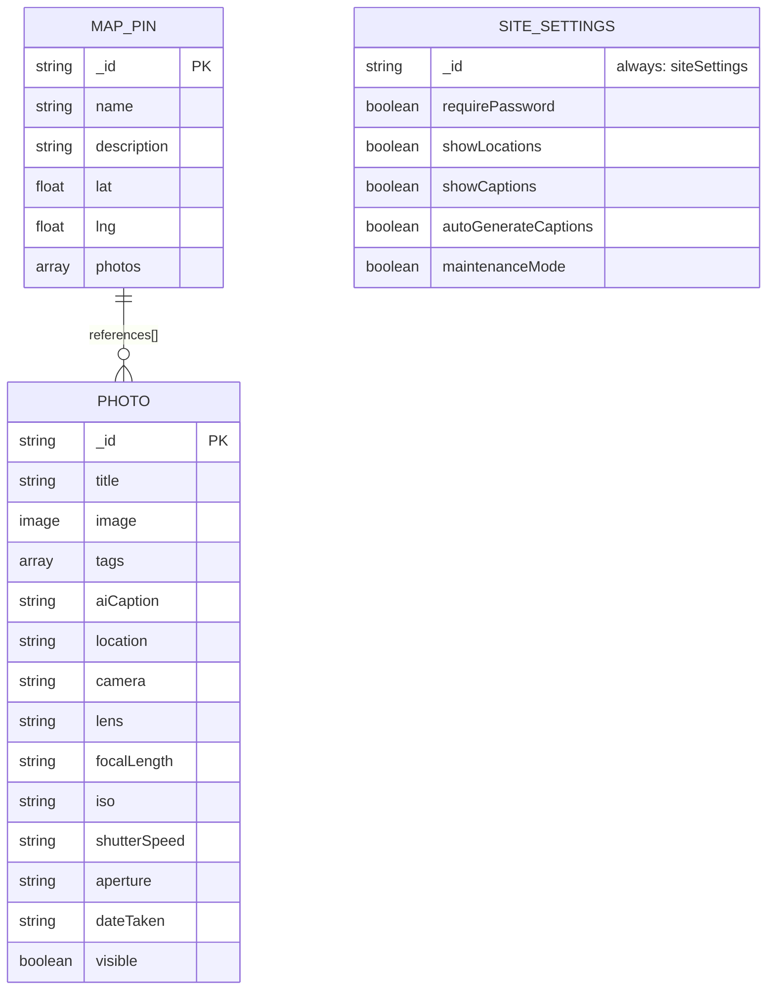
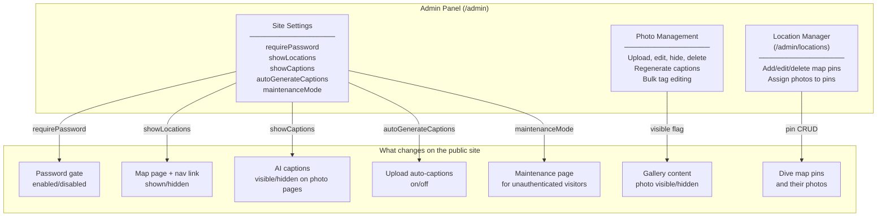
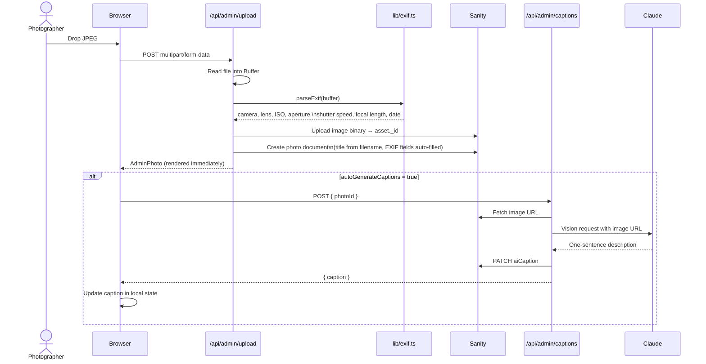
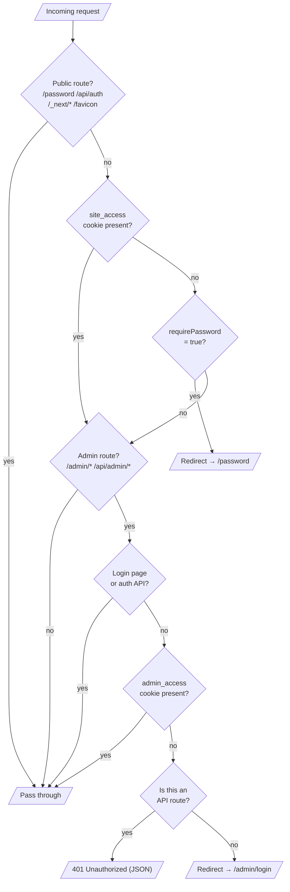
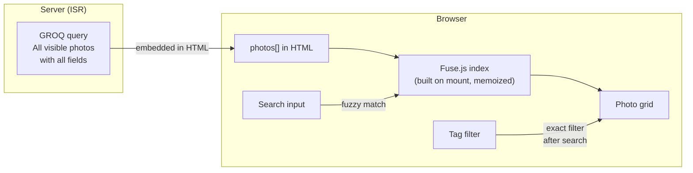
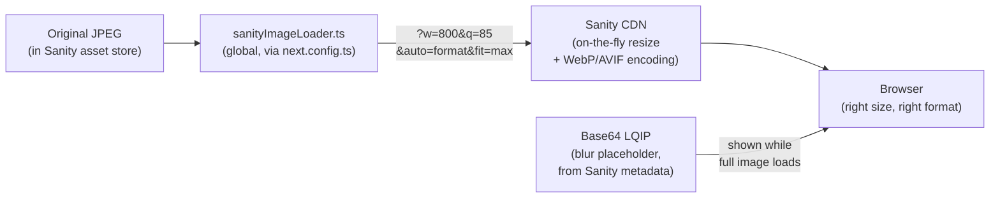
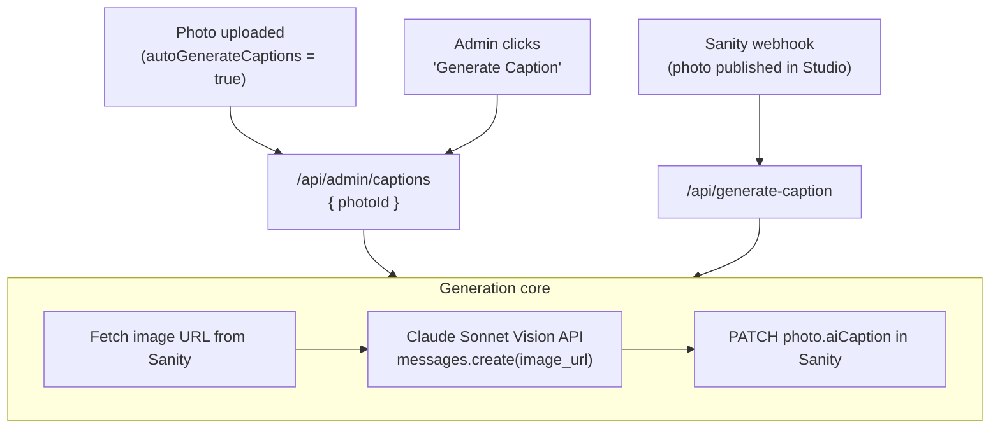
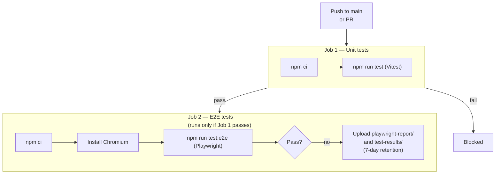

# Submarine Division — Architecture

A password-protected underwater photography portfolio. Visitors search and browse photos; the photographer manages everything — uploads, captions, map pins, and site-wide settings — through a custom admin panel.

---

## Table of Contents

1. [What this site does](#1-what-this-site-does)
2. [The Core Stack: Next.js + Vercel + Sanity](#2-the-core-stack-nextjs--vercel--sanity)
3. [Alternatives Considered](#3-alternatives-considered)
4. [Data Model and Schema Design](#4-data-model-and-schema-design)
5. [The Admin Panel as a Control Plane](#5-the-admin-panel-as-a-control-plane)
6. [Authentication](#6-authentication)
7. [Search](#7-search)
8. [Images](#8-images)
9. [AI Captions](#9-ai-captions)
10. [Maps](#10-maps)
11. [Testing](#11-testing)
12. [CI/CD](#12-cicd)
13. [Project Structure](#13-project-structure)

---

## 1. What this site does

From the outside, this is a photo gallery. The interesting engineering is in the layers underneath:

- A **password gate** that blocks every page before any HTML is served — implemented in Edge Middleware so nothing leaks, not even the page title.
- **Client-side fuzzy search** that indexes every photo by title, tags, AI-generated captions, location, and all EXIF metadata — zero network round-trips per keystroke.
- An **AI caption pipeline** that automatically describes each photo using Claude's vision API when a photo is uploaded, producing search-optimized natural-language sentences.
- A **custom admin panel** that controls not just photos but also site-wide feature flags — the password gate, the map page, caption visibility, and maintenance mode — all without touching code or environment variables.
- A **custom JPEG EXIF parser** (no third-party library) that auto-populates camera, lens, aperture, ISO, and date fields from the binary metadata embedded in every photo file.

---

## 2. The Core Stack: Next.js + Vercel + Sanity

These three were chosen together, not independently. They form an integrated system where each piece's strengths compensate for the others' limitations.



**Why this combination specifically:**

**Sanity is the single source of truth for all content and images.** It stores documents, manages binary assets (original JPEGs), and serves images from its CDN with on-the-fly resizing. Having the CMS and the image CDN in the same system means there's no separate image host to manage, no signed URL strategy, and no second storage bucket. When a photo is uploaded through the admin panel, it goes into Sanity and every part of the application — galleries, maps, captions — has immediate access to both the document and the asset.

**Next.js's rendering model maps directly onto this site's content patterns.** The gallery page and photo detail pages don't change every second — they change when a photo is uploaded. Incremental Static Regeneration (ISR) means these pages are pre-rendered as static HTML and cached at Vercel's edge, but automatically re-rendered in the background when Sanity data changes. The result is a page that loads as fast as a static site but stays fresh within 60 seconds of a content change — no manual cache invalidation or rebuild triggers.

**Vercel is the native deployment target for Next.js.** Edge Middleware, ISR, and Server Components all have first-class support without configuration. The password gate runs as Edge Middleware, which executes at the CDN level before the request hits the Next.js runtime — so unauthenticated visitors are redirected without ever reaching application code, leaking HTML, or hitting the Sanity API.

### How each route is rendered

| Route         | Strategy             | Why                                                         |
| ------------- | -------------------- | ----------------------------------------------------------- |
| `/` (landing) | Static (SSG)         | Hero photos never change between deployments                |
| `/gallery`    | ISR, 60 s revalidate | Updates within a minute of a new photo upload               |
| `/photo/[id]` | ISR, 60 s revalidate | Same — plus generates dynamic Open Graph metadata per photo |
| `/map`        | ISR                  | Dive locations change infrequently                          |
| `/about`      | Static (SSG)         | Never changes                                               |
| `/admin/*`    | Dynamic, no cache    | Always shows current data to the photographer               |
| `/password`   | Static (SSG)         | Same form for everyone                                      |

---

## 3. Alternatives Considered

### Full-stack options

Before settling on the current stack, several complete approaches were evaluated:

**WordPress (or a PHP CMS)**

WordPress has massive ecosystem support and built-in media management. But the default theme system, PHP rendering, and monolithic architecture make it poorly suited to a custom React UI with a specific search and filtering experience. Getting TypeScript, custom client-side search, and a Next.js image optimization pipeline would require fighting the framework rather than working with it.

**Squarespace / Framer / Webflow**

No-code/low-code platforms. Fast for standard portfolios, but the entire point of this project is demonstrating engineering capability.

**Ghost**

Ghost is excellent for text-heavy content (newsletters, blogs). Its media management is minimal and not designed for browsable photo galleries with EXIF metadata.

**Gatsby + Contentful**

Gatsby's static-site approach pre-dates ISR. Adding a photo requires a full rebuild triggered by a webhook, which takes minutes and creates pressure to batch uploads. Contentful is a well-regarded CMS but charges per content type at higher volumes and lacks a built-in image CDN. Viable, but slower feedback loop and higher operational cost than the chosen stack.

---

### CMS: Sanity vs. alternatives

| Option                    | Strengths                                                                                                                   | Weaknesses                                                                                                           | Verdict    |
| ------------------------- | --------------------------------------------------------------------------------------------------------------------------- | -------------------------------------------------------------------------------------------------------------------- | ---------- |
| **Sanity**                | GROQ projections return exactly what you need; write API callable from server; images + CDN in one system; real-time studio | Sanity-specific query language (GROQ) to learn; hosted (not self-controlled)                                         | **Chosen** |
| **Contentful**            | Mature, widely used; strong editorial UX                                                                                    | GraphQL/REST more verbose than GROQ; no built-in CDN transforms; pricing tier structure                              | Not chosen |
| **Strapi (self-hosted)**  | Full control; open source; REST + GraphQL                                                                                   | Requires a server to run; no CDN; operational overhead                                                               | Not chosen |
| **PostgreSQL + S3**       | Maximum control; no vendor lock-in; SQL is universally known                                                                | Schema migrations; separate image host; signed URL strategy for private assets; no editorial UI without building one | Not chosen |
| **Markdown files in Git** | Zero cost; version-controlled content                                                                                       | No binary asset management; no UI for uploading photos; no real-time editing                                         | Not chosen |

The decisive factor for Sanity was that it solves three problems simultaneously: document storage, image hosting, and a real-time editorial UI. The alternatives would have required combining two or three separate services to achieve the same result.

---

### Hosting: Vercel vs. alternatives

| Option                       | Strengths                                                                                                | Weaknesses                                                                                                  | Verdict    |
| ---------------------------- | -------------------------------------------------------------------------------------------------------- | ----------------------------------------------------------------------------------------------------------- | ---------- |
| **Vercel**                   | Native Next.js support; zero-config Edge Middleware; ISR works without configuration; generous free tier | Pricing can spike with large image optimization usage (bypassed here via Sanity CDN)                        | **Chosen** |
| **Netlify**                  | Good Next.js support; similar edge functions                                                             | ISR support has historically lagged Vercel; separate config needed for middleware                           | Not chosen |
| **AWS Amplify**              | Full AWS integration                                                                                     | Verbose configuration; slower deploys; ISR support is managed separately                                    | Not chosen |
| **Self-hosted (Docker/VPS)** | Full control                                                                                             | Requires managing infrastructure, TLS, process management; defeats the purpose of choosing Next.js + Vercel | Not chosen |
| **Cloudflare Pages**         | Excellent edge performance; low cost                                                                     | Next.js App Router + Server Components support is incomplete (Worker compatibility layer, not native)       | Not chosen |

---

### Search: Fuse.js vs. alternatives

| Option                        | Latency                   | Cost                | Typo tolerance          | Verdict    |
| ----------------------------- | ------------------------- | ------------------- | ----------------------- | ---------- |
| **Fuse.js (client-side)**     | Zero (in-memory)          | Free                | Yes (threshold tunable) | **Chosen** |
| **Algolia**                   | ~100–200 ms (network)     | Free tier then paid | Excellent               | Not chosen |
| **Server-side GROQ search**   | ~200–500 ms per keystroke | Sanity API calls    | None natively           | Not chosen |
| **Postgres full-text search** | ~50–150 ms                | Requires a database | Limited                 | Not chosen |
| **Typesense (self-hosted)**   | ~20–50 ms                 | Server cost         | Yes                     | Not chosen |

The corpus is measured in hundreds of photos, not millions. The entire dataset fits in browser memory without noticeable impact. Client-side search with Fuse.js eliminates network latency entirely — the index is built once when the gallery mounts, and every subsequent search is synchronous. At the scale of a portfolio, the operational simplicity (no search service to manage) outweighs the marginal quality advantage of a dedicated search provider.

---

## 4. Data Model and Schema Design

Three document types live in Sanity. Each was designed with a specific question: _what will the application need to query, search, and update?_



### Photo schema design decisions

**Tags as `string[]`, not references to a Tag document type**

The alternative — a separate `Tag` document type with `Photo.tags` as an array of references — would add referential integrity (no orphaned tags, canonical spelling) but require a join on every query. For a search-heavy interface where Fuse.js needs to index every photo's tags as flat strings, the extra indirection adds complexity for no real benefit. Strings are simpler to query, simpler to index, and simpler to edit inline in the admin panel.

**EXIF fields as flat top-level strings, not a nested object**

```
// What was considered:
photo.exif.camera, photo.exif.iso, photo.exif.aperture

// What was built:
photo.camera, photo.iso, photo.aperture
```

Fuse.js requires dot-notation keys for nested fields (`"exif.camera"`), which adds verbosity to the index configuration and slightly complicates PATCH mutations. Flat fields make GROQ projections, Fuse.js key definitions, and TypeScript types all simpler. The downside — EXIF fields are mixed with editorial fields at the same level — is a minor organisational concern that doesn't affect any runtime behavior.

**`dateTaken` as a string (`YYYY:MM:DD`), not a datetime**

EXIF embeds dates as `YYYY:MM:DD HH:MM:SS` without timezone information. Converting this to a timezone-aware datetime at parse time would require assuming a timezone (wrong for underwater photography, which happens in different countries). Storing it as a string preserves the original value without lossy conversion. It sorts lexicographically by date (since the format is zero-padded), which is all the application needs.

**`visible` boolean instead of just deleting photos**

The admin panel has a true delete button (hard-deletes the document and the image asset). The `visible` flag is a separate "archive" state for photos you want to temporarily hide — maybe the metadata is incomplete, or the subject identification is uncertain. Setting `visible: false` removes the photo from all public queries (`visible != false` in GROQ handles both `false` and missing field) while leaving the original JPEG and all metadata intact in Sanity. It's reversible with a single toggle.

**`aiCaption` as a dedicated field, not `description`**

Calling it `aiCaption` instead of `description` signals that this field is machine-generated and shouldn't be hand-edited. It is also marked read-only in the Sanity Studio configuration. The distinction matters for search weighting: hand-curated `tags` and `title` are ranked higher in the Fuse.js index than `aiCaption`, because a photographer's deliberate classification is more reliable than an AI inference.

---

### MapPin schema design decisions

**MapPin references Photos — Photos don't reference MapPin**

The relationship could go either way. Putting a `mapPinId` field on each `Photo` document would mean "this photo was taken at this location." Instead, the `MapPin` document holds an array of photo references — "these photos are associated with this dive site."

The pin-centric model was chosen because:

1. A dive site exists as a concept even before any photos are assigned to it
2. Reassigning multiple photos to a different pin requires updating one document, not many
3. The location manager UI naturally works in terms of "which photos belong to this pin", not "which pin does this photo belong to"

**`photos` as a reference array (not embedded image data)**

`MapPin.photos` contains `{ _type: 'reference', _ref: photo._id }` — Sanity references, not copies of the photo data. This means the map pin page always shows current photo metadata (titles, captions) without needing to update the pin document when a photo is edited.

---

### SiteSettings singleton design decisions

**Why a singleton document at all**

The five feature flags in `SiteSettings` could have been stored in environment variables. Environment variables are set at deploy time — changing them requires a new deployment. A Sanity document is writable at runtime via the admin panel, meaning the photographer can toggle the password gate or enable maintenance mode in seconds without touching code. The tradeoff is a Sanity API call in the middleware, which is mitigated by a 60-second in-process cache.

**Why `_id: "siteSettings"` (the singleton pattern)**

Sanity's normal document model supports multiple documents per type. For settings, you want exactly one. Fixing the `_id` to a known string (`"siteSettings"`) enforces uniqueness at the application level — the GROQ query always fetches `*[_id == "siteSettings"][0]`, and there's no ambiguity about which settings document is active. The Sanity Studio is configured to navigate directly to this document rather than showing a list.

**`coalesce()` for safe defaults in GROQ**

Every settings query uses `coalesce()` to supply defaults for fields that may not exist in older documents:

```groq
*[_type == "siteSettings" && _id == "siteSettings"][0] {
  "requirePassword": coalesce(requirePassword, true)
}
```

This means adding a new boolean field to the schema doesn't require a data migration — the first time the new field is queried, `coalesce()` returns the default. New feature flags can be deployed to the schema and immediately used in application code before any document has been updated.

---

## 5. The Admin Panel as a Control Plane

The admin panel has two distinct responsibilities: **managing content** (photos, map pins) and **controlling site behavior** (feature flags). Both happen through the same UI, and both work without touching environment variables or redeploying.



### How each setting changes the public site

**`requirePassword`** — Read by Edge Middleware on every unauthenticated request. When `false`, the middleware skips the redirect to `/password` and lets the visitor through to the gallery directly. The middleware caches this value for 60 seconds per worker instance to avoid a Sanity API call on every request.

```
requirePassword: true  → every visitor hits /password before seeing anything
requirePassword: false → site is open, no password needed (e.g. during a job search)
```

**`showLocations`** — Controls whether the `/map` route is linked in the navigation and accessible. Useful if the map is incomplete or under construction — you can hide it from visitors without removing the route from the codebase.

**`showCaptions`** — Controls whether `aiCaption` text is rendered on individual photo pages and gallery modals. Captions are always stored in Sanity regardless of this setting; this is purely a display flag. The photographer might disable captions if the AI descriptions for a batch of photos need review before being shown publicly.

**`autoGenerateCaptions`** — When `true`, the admin panel automatically calls `/api/admin/captions` after every successful photo upload, triggering the Claude vision pipeline. When `false`, captions must be generated manually via the "Generate Caption" button or the bulk action. Useful to toggle off when uploading a large batch — generate captions once at the end rather than making one Claude API call per upload.

**`maintenanceMode`** — Shows a "coming soon" page to unauthenticated visitors instead of redirecting to the password form. Authenticated visitors (who already have the cookie) still see the full site.

---

### Photo management: how the upload pipeline works

Every photo upload triggers a server-side pipeline:



The EXIF parser (`lib/exif.ts`) is a custom implementation — no third-party library. It reads the JPEG binary directly: locating the APP1 segment, detecting byte order (big-endian `MM` vs little-endian `II` depending on camera manufacturer), walking the IFD entry table, and extracting Make, Model, Focal Length, ISO, Exposure Time, F-Number, and DateTimeOriginal. This avoids pulling in a large dependency for what amounts to a few hundred bytes of binary parsing logic.

---

### Inline photo editing and optimistic updates

The admin photo list supports inline editing of every metadata field. When the photographer changes a value:

1. The UI updates the field immediately in local React state (optimistic update)
2. A `PATCH /api/admin/photos` request is sent with only the changed fields
3. The server patches the Sanity document
4. If the request fails, the field reverts to its previous value

This pattern keeps the editing experience fast on slow connections — the photographer sees the change instantly and the network request happens in the background.

The `visible` toggle works the same way. Setting a photo to hidden (`visible: false`) patches the Sanity document and the photo disappears from the local admin list immediately. The public gallery picks up the change on the next ISR cycle (within 60 seconds).

---

## 6. Authentication

Two password tiers, each enforced at a different layer:



**Site tier** — A single shared password, set in `SITE_PASSWORD` env var. When correct, the server sets a `site_access=granted` cookie (7 days, `HttpOnly`, `SameSite=Lax`). The middleware checks this cookie on every request before any page is rendered.

**Admin tier** — A separate password, set in `ADMIN_PASSWORD` env var. Sets `admin_access=granted` (8 hours). Required for all `/admin/*` pages and `/api/admin/*` routes. The site cookie must already be present — you can't reach the admin login page without first passing the site gate.

Both cookies are `HttpOnly`, meaning they're inaccessible to JavaScript and invisible to XSS attacks. Both are `Secure` in production (HTTPS only).

The site gate can be disabled at runtime by setting `requirePassword: false` in the admin settings, without changing `SITE_PASSWORD` — the password still works, the middleware just stops requiring it.

---

## 7. Search

No search API endpoint. The entire index lives in browser memory.



The GROQ query fetches every visible photo with every field — title, tags, aiCaption, location, camera, lens, focalLength, aperture, shutterSpeed, iso, dateTaken — and embeds the full JSON payload in the initial HTML. When the gallery component mounts, it builds a Fuse.js index once (via `useMemo`) and all subsequent searches are synchronous in-memory lookups.

**Search weights reflect editorial trust:**

```
tags         weight 3  — photographer chose these deliberately
title        weight 2  — human-written
aiCaption    weight 1  — AI-generated, lower confidence
location     weight 1
camera       weight 1  — searchable by gear: "nikon", "sigma"
lens         weight 1
focalLength  weight 0.5
aperture     weight 0.5
shutterSpeed weight 0.5
iso          weight 0.5
dateTaken    weight 0.5
```

`threshold: 0.35` — tolerates minor typos ("hammerhed" finds "hammerhead").

Search and tag filter compose: an active tag filter applies _after_ Fuse.js results, narrowing to photos that both match the query and carry the selected tag.

---

## 8. Images

All images are stored in Sanity and served from Sanity's CDN. A custom Next.js image loader handles the URL construction, registered globally so every `<Image>` component in the codebase automatically benefits.



```typescript
export default function sanityLoader({
  src,
  width,
  quality,
}: ImageLoaderProps): string {
  const url = new URL(src);
  url.searchParams.set("w", String(Math.min(width, 2000))); // never upscale past 2000px
  url.searchParams.set("q", String(quality ?? 85));
  url.searchParams.set("auto", "format"); // Sanity serves WebP or AVIF based on Accept header
  url.searchParams.set("fit", "max"); // never upscale past original dimensions
  return url.toString();
}
```

`new URL()` + `searchParams.set()` (rather than string concatenation) is deliberate — it prevents duplicate parameters if the source URL already contains query strings from Sanity's asset store.

**Blur-up loading:** Sanity automatically generates a 20×20 blurred thumbnail for every uploaded asset and stores it as a base64 string (`metadata.lqip`). The GROQ query fetches this as `blurDataURL` and it's passed to `<Image placeholder="blur">` — the browser renders a blurred placeholder immediately, then cross-fades to the full image as it loads. No client-side JavaScript required.

**Why not use Next.js's built-in image optimizer?** It would route every image request through Vercel's optimization layer (a second CDN hop after Sanity's own CDN), count against Vercel's image optimization quota, and add latency. Sanity's CDN already transforms images at the edge — bypassing the Next.js optimizer in favor of the Sanity CDN is strictly better here.

---

## 9. AI Captions

Captions are single-sentence natural-language descriptions generated by Claude's vision API. The prompt instructs Claude to name the subject species (if identifiable), its behavior, and the environment — producing sentences like _"A humphead wrasse hovers motionless above a coral pinnacle in blue open water"_ that maximise search recall across many different search terms.

**Three ways to trigger caption generation:**



The on-demand path (`/api/admin/captions`) is the primary one. The Sanity webhook path (`/api/generate-caption`) handles photos published directly through the Sanity Studio interface rather than the admin panel.

`autoGenerateCaptions` being toggleable in the admin settings is important for bulk uploads — you might upload 30 photos from a dive trip and prefer to generate all captions at once with the bulk button rather than making 30 Claude API calls serially during the upload.

---

## 10. Maps

The `/map` page renders an interactive Leaflet map showing dive locations as clickable pins. Each pin opens a popup with a photo grid — photos are associated with pins through the `MapPin.photos` reference array in Sanity.

Leaflet has browser-only globals (`window`, `document`) incompatible with Next.js server rendering. The component is imported with `dynamic(() => import('./LeafletMap'), { ssr: false })`, which excludes it from the server render and loads it client-side only.

OpenStreetMap tiles (free, no API key) replace Mapbox or Google Maps tiles. For a portfolio site with no traffic SLAs, the tile quality is sufficient and the zero-cost, zero-key setup is the right trade-off.

The `/map` page is gated by the `showLocations` feature flag — if disabled in admin settings, the map link disappears from the navigation and the page returns a 404.

---

## 11. Testing

Two test layers with different purposes:

**Vitest (unit + component)** — Tests logic and components in isolation, without a running server. Fast (~1 s total). Covers the search index (Fuse.js configuration, query results, scoring), the image loader (URL parameter construction, 2000px width cap), GA4 event helpers, middleware authentication logic, and React components (gallery filter state, search bar input, tag selection).

**Playwright (end-to-end)** — Tests the full application with a real browser against a real Next.js dev server. Covers the password gate redirect, gallery search and filtering, photo modal interaction, keyboard navigation, and individual photo pages. Slower (~60 s), but catches integration bugs that unit tests miss.

One non-obvious detail: the auth E2E test must use `storageState: { cookies: [], origins: [] }` (an explicit empty object) rather than `storageState: undefined`. In Playwright 1.58, `undefined` falls through to the project-level default (the saved auth cookie), so the browser silently arrives at the gallery already authenticated — and the redirect assertion fails. An empty object is the correct way to opt out of a project-level storage state.

---

## 12. CI/CD



E2E tests run with `CI=true`, which disables Playwright's `reuseExistingServer` — a fresh Next.js process starts for every CI run. `SANITY_READ_TOKEN` is intentionally absent from CI secrets. Without it, the middleware's Sanity fetch returns 401, the catch block returns `true` (fail-safe), and the password gate is always active — the auth test passes correctly without requiring an additional secret to be managed.

On failure, Playwright saves browser traces (a zip containing a full recording of the browser session, including network requests, console logs, and screenshots) as GitHub Actions artifacts. Remote debugging becomes practical: download the trace, open it in `playwright show-trace`, step through the test frame-by-frame.

---

## 13. Project Structure

```
submarine_division_website/
├── .github/workflows/test.yml       # CI: Vitest → Playwright
│
├── studio/                          # Sanity Studio (the CMS editor UI)
│   └── schemaTypes/
│       ├── photoType.ts             # Photo: EXIF fields, tags, AI caption, visibility
│       ├── mapPinType.ts            # Dive location with lat/lng and photo references
│       └── siteSettingsType.ts      # Feature flags singleton
│
└── web/                             # Next.js application
    ├── app/
    │   ├── page.tsx                 # Landing page (hero carousel, SSG)
    │   ├── gallery/page.tsx         # Gallery (ISR, 60 s)
    │   ├── photo/[id]/page.tsx      # Photo detail (ISR, OG metadata)
    │   ├── map/page.tsx             # Interactive dive map (ISR)
    │   ├── about/page.tsx           # About page (SSG)
    │   ├── password/page.tsx        # Site password form
    │   ├── admin/page.tsx           # Admin dashboard (server → client)
    │   ├── admin/locations/         # Map pin manager
    │   └── api/
    │       ├── auth/                # Site password validation
    │       ├── admin/auth/          # Admin password validation + logout
    │       ├── admin/upload/        # Photo upload + EXIF extraction
    │       ├── admin/photos/        # Photo PATCH + DELETE
    │       ├── admin/photos-list/   # Lightweight list for location picker
    │       ├── admin/captions/      # Claude caption generation
    │       ├── admin/settings/      # SiteSettings GET + PATCH
    │       ├── admin/locations/     # Map pin CRUD
    │       └── generate-caption/    # Sanity webhook handler
    │
    ├── components/
    │   ├── Gallery.tsx              # Search, filter, photo grid, modal (client)
    │   ├── AdminDashboard.tsx       # Photo list, upload, settings panel (client)
    │   └── ...
    │
    ├── lib/
    │   ├── sanity.ts                # Sanity clients (read/write) + GROQ queries
    │   ├── search.ts                # Fuse.js index config + search helper
    │   ├── exif.ts                  # Custom JPEG EXIF binary parser
    │   ├── sanityImageLoader.ts     # Next.js image loader for Sanity CDN
    │   └── analytics.ts            # Google Analytics 4 event helpers
    │
    ├── middleware.ts                # Edge auth gate — runs on every request
    ├── __tests__/                   # Vitest unit + component tests
    ├── e2e/                         # Playwright end-to-end tests
    ├── vitest.config.ts
    └── playwright.config.ts
```
